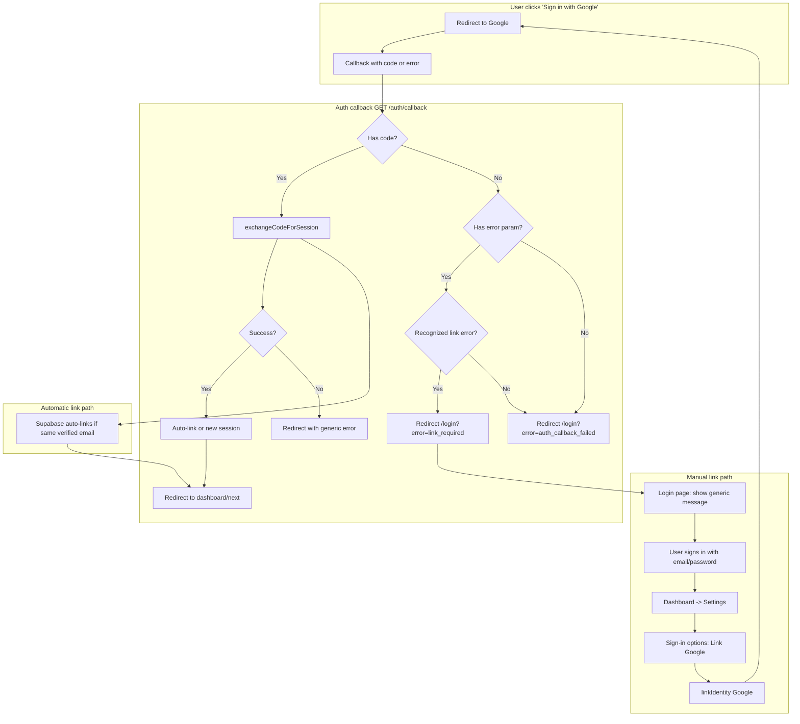

# Account Linking Implementation Plan

Structured plan for implementing **account linking** in the Fanflet web app: allow users who signed up with email/password to link Google (same email) and sign in with either method.

---

## 1. Flows Overview



- **Flow A (automatic linking):** User signs in with Google; Supabase matches verified email and links identity. Callback receives `code`, `exchangeCodeForSession` succeeds, user lands in app. No app logic beyond current success path.
- **Flow B (manual link after OAuth error):** User signs in with Google but an existing email/password account exists and auto-link did not run (e.g. manual linking only, or Supabase returns "multiple accounts"). Callback receives `error` + `error_description`. App redirects to login with a **generic** `link_required` code, shows safe message, and directs user to sign in with password then link Google in Settings.

---

## 2. Supabase Configuration Checklist

| Item | Where | Action |
|------|--------|--------|
| **Automatic linking** | Dashboard -> Auth -> Providers (or GoTrue config) | Ensure automatic linking is enabled so same verified email can link. |
| **Manual linking** | Dashboard -> Auth -> [config] or env `GOTRUE_SECURITY_MANUAL_LINKING_ENABLED` | Enable manual linking so logged-in users can call `linkIdentity({ provider: 'google' })`. |
| **Google provider** | Auth -> Providers -> Google | Already configured (current OAuth works). No change required for linking. |
| **Email verification** | Auth settings | Keep email verification on for email/password so auto-linking only links to verified emails (security). |

**Reference:** [Supabase Identity Linking](https://supabase.com/docs/guides/auth/auth-identity-linking) - automatic linking (same verified email), manual linking (beta) via dashboard or `GOTRUE_SECURITY_MANUAL_LINKING_ENABLED`.

---

## 3. Auth Callback Changes

**File:** `apps/web/app/auth/callback/route.ts`

**Current behavior:** Reads only `code`. On success calls `exchangeCodeForSession(code)` and redirects. If no `code`, redirects to `/login?error=auth_callback_failed`. Does not read `error` or `error_description`.

**Required changes:**

1. **Before handling `code`:** Read `error` and `error_description` from `searchParams`. If `error` is present:
   - **Do not** redirect with `error_description` in the URL (avoid leaking "this email already has an account").
   - If the error indicates "multiple accounts" / "same email" (e.g. match `error_description` for strings like `Multiple accounts with the same email` or use a known Supabase error code if documented), redirect to:
     - `{origin}/login?error=link_required`  
     - Optionally append `&next=...` if `next` is safe, so after linking the user can be sent to the intended destination.
   - For any other OAuth error, redirect to `/login?error=auth_callback_failed` (generic).
   - Return immediately; do not call `exchangeCodeForSession` when `error` is present.

2. **Keep existing success path:** When `code` is present and no `error`, call `exchangeCodeForSession(code)`. On success, keep current behavior (metadata, audience handling, role-based redirect). On `exchangeCodeForSession` failure, redirect to `/login?error=auth_callback_failed` (generic).

3. **Safety:** Never expose raw `error_description` or server messages in redirect URLs or client-visible responses (prevents user enumeration).

**Pseudocode sketch:**

```ts
// At start of GET handler, after parsing searchParams:
const errorParam = searchParams.get('error')
const errorDescription = searchParams.get('error_description')

if (errorParam) {
  const isLinkRelated = /* match known "multiple accounts" / same-email phrasing */ 
  const safeNext = isSafeNext(next) ? next : null
  const q = new URLSearchParams({ error: isLinkRelated ? 'link_required' : 'auth_callback_failed' })
  if (safeNext) q.set('next', safeNext)
  return NextResponse.redirect(`${origin}/login?${q.toString()}`)
}
// Then existing: if (code) { exchangeCodeForSession(...) ... }
```

---

## 4. Login Page Messaging

**File:** `apps/web/app/(auth)/login/page.tsx`

**Current behavior:** Displays `error` from component state (set by form submit or Google button). Does not read `error` from URL on load, so `?error=auth_callback_failed` (and similar) do not show a message.

**Required changes:**

1. **Read `error` from URL on mount:** e.g. `const errorCode = searchParams.get('error')`. Map `errorCode` to a **user-facing message**; do not display raw query params or server messages.
2. **Message map (safe, no enumeration):**
   - `auth_callback_failed` -> e.g. "Sign-in didn't complete. Please try again."
   - `link_required` -> e.g. "Sign in with your email and password below. You can then link Google in Settings -> Sign-in options so you can use either method next time."
   - Other known codes (e.g. from impersonation) -> keep existing or add to map. Default for unknown -> generic "Sign-in failed. Please try again."
3. **Optional:** For `link_required`, add a short hint or link: "After signing in, go to **Settings** and open **Sign-in options** to link Google."
4. **Preserve `next` and `mcp_state`:** When redirecting from callback with `link_required`, pass `next` so after the user signs in (and optionally links in Settings), they can be redirected to the original destination. Login form already forwards `next` in hidden input; ensure the link-to-settings hint doesn't drop `next`.

**Implementation note:** Initialize `error` state from the mapped message for `errorCode` on first render (or when `searchParams` change), so the banner shows without requiring a form submit.

---

## 5. Dashboard Settings: "Sign-in options" / Linked Accounts

**File (page):** `apps/web/app/dashboard/settings/page.tsx`  
**New component(s):** e.g. `apps/web/components/dashboard/sign-in-options-card.tsx` (or section inside a new "Security" card).

**Data:** Use Supabase Auth APIs:

- **Identities:** `supabase.auth.getUser()` returns `user.identities` (array of linked identities; each has `provider`, e.g. `email`, `google`). Alternatively use `supabase.auth.getUserIdentities()` if available in your client version for a clearer list.
- **Link:** When user is logged in, call `supabase.auth.linkIdentity({ provider: 'google' })` (redirects to Google; return URL must hit auth callback; after successful link, callback will have session and can redirect back to settings).
- **Unlink:** `supabase.auth.unlinkIdentity(identity)` for a specific identity; user must have at least two identities to unlink one (Supabase constraint).

**UI spec:**

1. **New section:** Add a **Sign-in options** (or **Security**) card/section on the dashboard settings page. Place it after Profile (and Notifications) and before Subscription (or in a logical order you prefer). Title e.g. "Sign-in options" with description "Manage how you sign in to your account."

2. **List current methods:** For the current user, display which sign-in methods are linked, e.g.:
   - "Email and password" (if `identities` includes `email` or equivalent),
   - "Google" (if `identities` includes `google`).
   Use provider labels only; no need to show emails for OAuth in this list.

3. **Link Google button:** If Google is not already linked, show a button: "Link Google account". On click, call `linkIdentity({ provider: 'google' })` from a **client component** (needs browser Supabase client). The OAuth redirect_uri must point to the same auth callback; after success, redirect user back to `/dashboard/settings` (e.g. pass `next=/dashboard/settings` in the callback URL when initiating link). Ensure the callback treats this as a "link" flow (session already exists) and does not overwrite or conflict with existing session.

4. **Unlink (optional):** If there are 2+ identities, show an "Unlink" (or "Remove") action for non-primary methods (e.g. Google). On confirm, call `unlinkIdentity(identity)`. Show a short warning that they will no longer be able to sign in with that method. Do not allow unlinking the last method (Supabase will enforce this; disable the button when only one identity remains).

5. **Server vs client:** The settings **page** can stay a server component that fetches user and passes `identities` (or a minimal list of provider names) to a client component. The client component performs `linkIdentity` / `unlinkIdentity` and refreshes the list (or revalidates) after success.

**Callback and link flow:** When initiating "Link Google", use the same `/auth/callback` with a `next=/dashboard/settings` (or similar). After `exchangeCodeForSession`, the user will have the same account with an additional linked identity; redirect to `next`. No need for a separate "link callback" route if the same callback handles both login and link (Supabase uses the same redirect for `signInWithOAuth` and `linkIdentity`).

**Files to add/touch:**

- `apps/web/app/dashboard/settings/page.tsx` - Add Sign-in options section; fetch and pass identities (or provider list) to client component.
- `apps/web/components/dashboard/sign-in-options-card.tsx` (or equivalent) - Client component: list providers, "Link Google" button, optional unlink with confirmation.

**Server action (optional):** If you prefer server actions for consistency, you can have a server action that returns the redirect URL for linking (so the client only does `window.location.href = url`). Linking itself still requires the OAuth round-trip in the browser.

---

## 6. Link Flow: Initiating "Link Google" from Settings

**Option A (recommended):** Client component uses `createBrowserClient()` from `@fanflet/db/client` (or `@/lib/supabase/client`), then:

```ts
// In client: e.g. redirectTo = `${window.location.origin}/auth/callback?next=/dashboard/settings`
const redirectTo = `${window.location.origin}/auth/callback?next=/dashboard/settings`
const { data, error } = await supabase.auth.linkIdentity({
  provider: 'google',
  options: { redirectTo },
})
if (data?.url) window.location.href = data.url
```

Use `redirectTo` so the callback receives `next=/dashboard/settings` and redirects the user back to settings after linking. The redirect URL must be in Supabase Auth -> URL Configuration -> Redirect URLs.

**Option B:** If link is initiated from a server action, the action would generate the OAuth URL (e.g. by calling the same logic that builds the redirect URL) and return it; the client then does `window.location.href = url`. Either way, the actual OAuth flow is browser-based and ends at `/auth/callback`.

**Important:** For `linkIdentity`, the user must already be logged in. The callback will receive `code` and exchange it; Supabase will attach the Google identity to the current user. No special branch in the callback is required if `exchangeCodeForSession` is used for both login and link; just preserve `next` and redirect accordingly.

---

## 7. Summary Checklist

| # | Task | Location |
|---|------|----------|
| 1 | Enable automatic linking and manual linking in Supabase | Dashboard / GoTrue config |
| 2 | In auth callback, handle `error` / `error_description`; redirect to `link_required` or `auth_callback_failed` (no leak of description) | `apps/web/app/auth/callback/route.ts` |
| 3 | On login page, read `error` from URL and map to safe messages; add message for `link_required` with CTA to sign in then link in Settings | `apps/web/app/(auth)/login/page.tsx` |
| 4 | Add Sign-in options section to dashboard settings; show linked providers and "Link Google" | `apps/web/app/dashboard/settings/page.tsx` + new client component |
| 5 | Implement "Link Google" via `linkIdentity({ provider: 'google' })` with redirect back to settings | New client component (e.g. `sign-in-options-card.tsx`) |
| 6 | (Optional) Unlink identity with confirmation when 2+ identities | Same client component |

---

## 8. Security and UX Notes

- **No user enumeration:** Never show "this email is already registered" or similar. Use only generic codes (`link_required`, `auth_callback_failed`) and fixed messages.
- **Same message for other OAuth errors:** If Supabase returns a different error (e.g. access_denied), still redirect with a generic code and message so an attacker cannot distinguish "email exists" from "user denied."
- **Email verification:** Rely on Supabase to only auto-link when the existing account's email is verified.
- **After linking:** User can sign in with either email/password or Google; both refer to the same user and `auth_user_id` in your app.

---

*Document version: 1.0. No full code - only specifications and touchpoints.*
