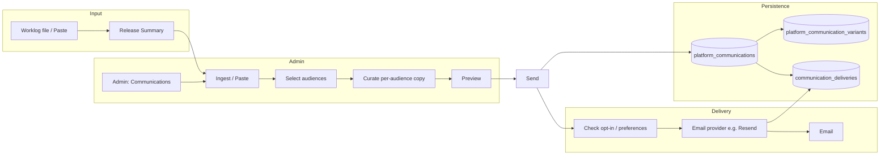

# Platform Communications and Release-Announcement System — Design Plan

This document defines a structured plan for a **platform communications and release-announcement system** in Fanflet. It enables platform administrators to communicate updates (e.g. from daily worklogs) to speakers, sponsors, and optionally audience members, from the admin portal, with a persistent log of what was sent.

---

## 1. Product Vision and Scope

### 1.1 What “Platform Communications” Means

- **Release announcements** — Primary use case. Notify users when new features, bug fixes, or infrastructure changes ship. Content is derived from worklog **Release Summary** sections (executive summary, New Features, Bug Fixes, Infrastructure).
- **Feature highlights** — Subset of release announcements: admins can pick specific items (e.g. “Subscriber Confirmation Emails”, “Sponsor Portal Settings”) to emphasize per audience.
- **Optional future types** — Maintenance windows, policy updates, or one-off campaigns could reuse the same pipeline (same data model with a `communication_type` or keep “release” as the only type until needed).

Scope is explicitly **outbound from platform to users**; it does not replace speaker-to-attendee emails (e.g. subscriber confirmation) or in-dashboard messaging between speakers and sponsors.

### 1.2 Audiences and How They Receive Messages

| Audience | Definition | Primary channel | Secondary (optional) |
|----------|------------|------------------|------------------------|
| **Speakers** | Users with a `speakers` row; primary product users. | **Email** (`speakers.email`) | In-app notice (Phase 3) |
| **Sponsors** | Users with a `sponsor_accounts` row. | **Email** (`sponsor_accounts.contact_email`) | In-app notice (Phase 3) |
| **Audience members** | See below. | Email to platform list **or** copy for speaker reuse | — |

**Who “audience members” are and how they are reached**

- **Option A — Platform marketing list:** Send to `marketing_subscribers` (platform-level list: email, source, interest_tier). Use for broad “what’s new for people interested in Fanflet” (e.g. product updates, events). Requires clear opt-in and unsubscribe (see Risks).
- **Option B — Speaker-facing copy only:** Do **not** send to attendees directly. Instead, provide **curated, audience-friendly copy** (e.g. “What to tell your attendees”) that speakers can paste into their own emails or show on fanflet pages. No new recipient list; just another “variant” in the admin UX (e.g. “Audience (copy for speakers)”).

**Recommendation:** Define **audience** in the product as **Option B in Phase 1–2** (copy for speakers to reuse). Add **Option A** (sending to `marketing_subscribers`) only when there is a clear opt-in and compliance process (Phase 3 or later). The plan below supports both: an “audience” variant can be either “copy only” or “copy + send to marketing_subscribers” once that is implemented.

---

## 2. Worklog-to-Content Flow

### 2.1 Ingesting Worklog Content

- **Phase 1:** **Manual paste.** Admin pastes the **Release Summary** section (or a subset) from a worklog file into a text area. Optional: file path or worklog date stored as metadata (e.g. “Source: worklog 260306”) for traceability only.
- **Phase 2:** Same as Phase 1; no structural change.
- **Phase 3 (optional):** **File picker or path.** Admin selects a file from `worklog/YYMMDD Summary.md` (e.g. from repo or uploaded file). Parser extracts:
  - One paragraph under “Release Summary”
  - Sections: “New Features” (each **Bold** title + following 2–3 sentences), “Bug Fixes”, “Infrastructure”
  - Stored as structured blobs or markdown so admins can **select which items** to include in a given communication.

Until Phase 3, “source” is freeform text or a single markdown blob (e.g. `source_content` or `worklog_excerpt`) with optional `source_reference` (e.g. `worklog/260306 ...`).

### 2.2 Selecting Which Items to Include

- **Phase 1:** One body per communication (no per-item selection). Admin composes or pastes one message; they can mentally “pick” from the worklog when pasting.
- **Phase 2:** If content is structured (e.g. after adding a simple parser or structured paste):
  - Show checkboxes for “New Features”, “Bug Fixes”, “Infrastructure” items.
  - Selected items are rendered into a **default body** per audience (or one default body), which the admin can then edit per audience (see below).
- **Phase 3:** Same selection UX, with optional automation from worklog file (path or upload).

### 2.3 Curating Copy per Audience

- **Per-audience variants:** Each communication can have **one variant per audience type** (speaker, sponsor, audience). Each variant has:
  - **Subject** (for email) and **Body** (HTML and/or plain text).
- **Reuse from source:** A single “source” body (or assembled from selected items) can be the starting point. Admin can:
  - Edit speaker subject/body (e.g. “What’s new for speakers”),
  - Edit sponsor subject/body (e.g. “New sponsor features”),
  - Edit audience subject/body (e.g. “What to tell your attendees” or “What’s new at Fanflet” for marketing list).
- **Templates (optional):** A **template** is a reusable shell (e.g. “Release announcement — Fanflet”) with placeholders like `{{title}}`, `{{body}}`, `{{unsubscribe_url}}`. Templates can live in code (e.g. React/HTML in the admin app) or in the DB (e.g. `communication_templates` with name, subject_line_template, body_html_template). Phase 1 can use **one hardcoded template** (e.g. “Release announcement”) in the admin app; Phase 2+ can add a template table if multiple formats are needed.
- **Where templates live:** Prefer **one server-side template** (e.g. in `apps/admin` or shared `packages/`) that accepts title + HTML body + footer (unsubscribe). No need for a DB template table in Phase 1.

---

## 3. Admin UX

### 3.1 Where It Lives

- **New section in admin app:** “Communications” (or “Announcements”) in the sidebar.
- **Placement:** After “Analytics” and before “Features & Plans” (or before “Impersonation Log”), so it’s visible but not mixed with core entity management.
- **Routes (suggested):**
  - `/(dashboard)/communications` — List of communications (log) + CTA “New communication”.
  - `/(dashboard)/communications/new` — Create flow (source → audience → variants → preview → send).
  - `/(dashboard)/communications/[id]` — View/detail (and optionally edit draft or see sent summary).

### 3.2 Main Flows

1. **Create from worklog/content**
   - Admin goes to **Communications → New**.
   - Step 1: **Source.** Paste Release Summary (or paste raw markdown). Optional: attach reference (e.g. worklog date or path). Save as draft.
2. **Choose audience(s)**
   - Step 2: **Audiences.** Checkboxes: Speakers, Sponsors, Audience (copy or future list). At least one required. For “Audience”, Phase 1 = “copy for speakers” only (no send).
3. **Edit/draft per-audience message**
   - Step 3: **Variants.** For each selected audience, show subject + body (rich text or markdown). Pre-fill from source if available. Allow editing.
4. **Preview**
   - Step 4: **Preview.** Render each variant in the same layout as the email (using the same template that will be used for send). Optional: “Send test to me” (current admin email).
5. **Send (or schedule)**
   - Step 5: **Send.** Confirm; then server action (or API route) sends via Resend to speakers and/or sponsors. Audience (Phase 1) = no send, only copy saved. Optionally support **schedule for later** (Phase 3) with `scheduled_at` and a job/cron.
6. **View log of past communications**
   - **Communications** list: table (or cards) with columns: Date, Title/Subject (or first subject), Audiences, Status (draft | scheduled | sent), Sent at, Created by. Click through to detail (summary of content, variants, and delivery stats).

### 3.3 Communication Log — What We Store

- **At communication level:** `id`, `created_at`, `created_by_admin_id`, `source_type` (e.g. `worklog_paste` | `worklog_file`), `source_reference` (optional text), `title` (internal title for the communication), `status` (draft | scheduled | sent), `scheduled_at` (nullable), `sent_at` (nullable).
- **Not stored in the log:** Full email body per variant (optional: store in `communication_variants` for history; otherwise only “summary” or first 200 chars of body for display).
- **Audit trail:** A separate **delivery log** (e.g. `communication_deliveries`) records: `communication_id`, `audience_type`, `recipient_type` (e.g. speaker | sponsor | marketing_subscriber), `recipient_id` or `email_hash` (for privacy), `channel` (email | in_app), `sent_at`, and optionally Resend `message_id` for bounces. This gives “what was sent to whom” without storing full bodies in the audit table.

---

## 4. Data Model and Persistence

### 4.1 Tables (Minimal but Sufficient)

**`platform_communications`** (or `announcements`)

| Column | Type | Purpose |
|--------|------|---------|
| `id` | UUID PK | |
| `created_at` | TIMESTAMPTZ | |
| `updated_at` | TIMESTAMPTZ | |
| `created_by_admin_id` | UUID FK → auth.users | Who created it |
| `source_type` | TEXT | e.g. `worklog_paste`, `worklog_file` |
| `source_reference` | TEXT nullable | e.g. `worklog/260306 ...` |
| `title` | TEXT | Internal title |
| `status` | TEXT | `draft` \| `scheduled` \| `sent` |
| `scheduled_at` | TIMESTAMPTZ nullable | For Phase 3 |
| `sent_at` | TIMESTAMPTZ nullable | Set when first send completes |

RLS: Only platform admins (e.g. via `user_roles.role = 'platform_admin'`) can SELECT/INSERT/UPDATE.

**`platform_communication_variants`** (per-audience content)

| Column | Type | Purpose |
|--------|------|---------|
| `id` | UUID PK | |
| `communication_id` | UUID FK → platform_communications | |
| `audience_type` | TEXT | `speaker` \| `sponsor` \| `audience` |
| `subject` | TEXT | Email subject |
| `body_html` | TEXT | Email body (HTML) |
| `body_plain` | TEXT nullable | Plain-text fallback |
| `template_id` | UUID nullable | Optional FK to templates table (Phase 2+) |

Unique on `(communication_id, audience_type)`. RLS: same as parent (admin-only).

**`communication_deliveries`** (audit trail of “what was sent to whom”)

| Column | Type | Purpose |
|--------|------|---------|
| `id` | UUID PK | |
| `communication_id` | UUID FK | |
| `audience_type` | TEXT | speaker \| sponsor \| audience |
| `recipient_type` | TEXT | e.g. `speaker` \| `sponsor` \| `marketing_subscriber` |
| `recipient_id` | UUID nullable | FK to speakers.id or sponsor_accounts.id (or null if hashed) |
| `email_hash` | TEXT nullable | SHA-256 of email for privacy-safe reporting |
| `channel` | TEXT | `email` \| `in_app` |
| `sent_at` | TIMESTAMPTZ | |
| `provider_message_id` | TEXT nullable | External message/campaign ID (Resend, Mailchimp, etc.) for bounces/debug |
| `email_provider` | TEXT nullable | e.g. `resend`, `mailchimp` — which provider sent this (audit) |

Indexes: `communication_id`, `(communication_id, audience_type)`, `sent_at`. RLS: admin-only read; inserts by backend only (no client-side insert). Raw email is not stored in this table; use `recipient_id` or `email_hash` only for privacy.

**`platform_communication_preferences`** (opt-in per user per category)

| Column | Type | Purpose |
|--------|------|---------|
| `id` | UUID PK | |
| `recipient_type` | TEXT | `speaker` \| `sponsor` \| `marketing` |
| `speaker_id` | UUID nullable | FK → speakers.id (when recipient_type = speaker) |
| `sponsor_account_id` | UUID nullable | FK → sponsor_accounts.id (when recipient_type = sponsor) |
| `email_hash` | TEXT nullable | For marketing (no FK); hashed for privacy |
| `category` | TEXT | e.g. `platform_announcements` |
| `opted_in` | BOOLEAN | |
| `opted_in_at` | TIMESTAMPTZ nullable | When they last opted in |
| `updated_at` | TIMESTAMPTZ | |

Unique per (recipient identifier, category). RLS: users read/update only their own rows; backend uses service role for send-time filtering. Default: not opted in until user enables in settings or signup.

**`platform_communication_unsubscribes`** (global opt-out by email)

| Column | Type | Purpose |
|--------|------|---------|
| `email_hash` | TEXT PK | SHA-256 of email (no raw email stored) |
| `unsubscribed_at` | TIMESTAMPTZ | |
| `category` | TEXT nullable | Optional: specific list; null = all platform emails |

Before any send, exclude addresses whose hash is in this table. RLS: backend-only write; preference-center page can insert via signed token or authenticated flow.

### 4.3 Optional: Structured Worklog Items (Phase 3)

If worklog is parsed into items, consider:

- **`platform_communication_items`** — `communication_id`, `item_type` (feature | bug_fix | infrastructure), `title`, `body`, `sort_order`. Links “which items were selected” for this communication. Not required for Phase 1–2.

---

## 5. Delivery and Channels

### 5.0 Email provider abstraction and future migration

- **Abstraction:** All email sending goes through a single **email provider interface** (e.g. `send(messages) → Promise<SendResult[]>`). Resend is the Phase 1 implementation; a future provider (e.g. Mailchimp) implements the same interface so the rest of the app is unchanged.
- **Our app owns:** Recipient resolution (from DB), content (variants), **opt-in/preference checks**, idempotency, and writing `communication_deliveries`. The provider only “sends this payload to this address” and returns success + external message ID.
- **Schema:** In `communication_deliveries`, use **`provider_message_id`** (not Resend-specific) and **`email_provider`** (e.g. `resend` | `mailchimp`) for audit.
- **Config:** e.g. `PLATFORM_EMAIL_PROVIDER=resend`; provider-specific env vars only in that provider’s implementation. Migration = new provider implementation + config switch; no change to communications UX or data model.

### 5.1 Email — initial implementation (Resend)

- **From / Reply-to:** Use existing `RESEND_FROM` (e.g. `Fanflet <onboarding@resend.dev>` or product domain). Set reply-to to a monitored address (e.g. `support@fanflet.com`) if desired.
- **Template:** One “release announcement” template in code: header (logo/branding), title, HTML body (from variant), footer with unsubscribe link (see Risks).
- **Sending:** Server action or API route (e.g. `POST /api/communications/send` or server action `sendCommunication`). Use service role or a server-side Supabase client with admin check to:
  - Load communication and variants;
  - Resolve candidates (speakers: `speakers.email`; sponsors: `sponsor_accounts.contact_email`);
  - **Filter by preferences:** Exclude any recipient who has not opted in to platform announcements (see 5.5) or who is in `platform_communication_unsubscribes`;
  - For each remaining recipient, check idempotency (see below), send via provider (Resend initially), then insert into `communication_deliveries` with `provider_message_id` and `email_provider`.

### 5.2 Idempotency and Duplicate Prevention

- **Idempotency key:** e.g. `(communication_id, audience_type, recipient_id_or_email_hash)`. Before sending, check if a row in `communication_deliveries` already exists for that key; if so, skip send (or return “already sent”).
- **No duplicate emails** for the same communication to the same person (e.g. speaker who is also sponsor gets one email per variant they’re in — or we could dedupe by email and send once; product decision).

### 5.3 In-App Notices (Optional / Phase 3)

- **Concept:** Table `user_notices` (or `announcements`): `id`, `user_id` (auth.users), `user_type` (speaker | sponsor), `communication_id` (nullable), `title`, `body_html`, `read_at` (nullable), `created_at`. When a communication is sent, optionally create a row per recipient for “in-app” channel; dashboard checks unread notices and shows a banner or dropdown.
- **Tie to communication:** `communication_id` links to `platform_communications`; same delivery can be logged in `communication_deliveries` with `channel = 'in_app'`.
- Can be deferred to Phase 3.

### 5.4 Rate Limiting and Safety

- Resend has account-level rate limits; batch sends in chunks if needed (e.g. 100 per batch, small delay).
- No client-side service role; all send logic server-side with admin auth check.
- Optional: “Send test to me” only sends to current admin email and does not write to `communication_deliveries` (or writes with a `test` flag).

### 5.5 User privacy, opt-in, and delivery preferences

Platform communications **must** respect user privacy and delivery preferences at all times. Users have the ability to manage notification preferences and list participation; **opt-in is required** before any platform announcement email.

**Opt-in requirement**

- **No send without consent.** For every audience (speakers, sponsors, marketing_subscribers), a recipient receives platform announcement emails only if they have **explicitly opted in** to that category (e.g. “Product updates” or “Platform announcements”). Default is **not opted in** for new users unless they consent during signup or in settings.
- **Record consent.** Store opt-in (and opt-out) with a timestamp and, where applicable, source (e.g. “settings”, “signup”, “preference_center”). Use this to filter the recipient list before every send.

**Where users manage preferences**

- **Speakers:** In the **web app** (speaker dashboard) → **Settings** → “Email preferences” or “Notification preferences”: toggle(s) for “Platform announcements” / “Product updates and release notes”. Link to this page in every platform email footer (e.g. “Manage preferences”).
- **Sponsors:** In the **sponsor dashboard** → **Settings** → same concept: “Platform announcements” on/off.
- **Audience (marketing list):** Opt-in at signup (clear checkbox and purpose); **preference center** reachable via link in every email (e.g. “Update preferences” or “Unsubscribe”) where they can opt out of categories or all platform emails.
- **Unsubscribe:** Every platform-sent email includes a one-click **unsubscribe** link (and optionally “Manage preferences”). Unsubscribe is honored immediately; no further sends to that address for that list/category until they opt back in.

**List participation and preference center**

- Users can see **which lists or categories** they are in (e.g. “Product updates for speakers”) and turn them on or off. No hidden lists; language is clear (e.g. “Receive release notes and product updates from Fanflet”).
- A **preference center** (or dedicated “Email preferences” page) shows: (1) which platform email categories exist, (2) current on/off state, (3) ability to opt out of all. For unauthenticated links (e.g. from email), use a secure token (e.g. signed link with email_hash) so only that recipient can change their preferences.
- **List participation** is defined by our data model (see below); we do not send to anyone who has opted out or never opted in.

**Privacy**

- **Delivery log:** Store only `recipient_id` (FK to speakers.id / sponsor_accounts.id) or **email_hash** (SHA-256) in `communication_deliveries`—never raw email in the audit table. Use hashes for reporting and idempotency; admins see “sent to N speakers” without exporting addresses.
- **Preference and unsubscribe data:** Minimal and purpose-limited. Unsubscribe table stores email_hash (not email) plus timestamp; preference table stores user identifier (speaker_id, sponsor_id, or email_hash for marketing) and category flags. Access restricted to backend send logic and, for “my preferences,” the authenticated user (or secure token for email-link preference center).
- **Compliance:** Document in privacy policy and terms: what we send, how to opt in/out, and that we honor preferences. Align with applicable regulations (e.g. CAN-SPAM, GDPR where relevant).

**Data model for preferences and unsubscribe**

- **`platform_communication_preferences`** (opt-in per user per category): e.g. `id`, `recipient_type` (speaker | sponsor | marketing), `recipient_id` (speaker_id or sponsor_account_id, nullable), `email_hash` (for marketing, nullable), `category` (e.g. `platform_announcements`), `opted_in` (boolean), `opted_in_at` (timestamptz nullable), `updated_at`. Unique per (recipient identifier, category). RLS: users can read/update only their own row(s); backend uses service role for send-time checks.
- **`platform_communication_unsubscribes`** (global opt-out by email): `email_hash` (PK or unique), `unsubscribed_at`, optional `category` (nullable = all). Before any send, exclude addresses that appear here (and respect `platform_communication_preferences.opted_in` so that opt-in and unsubscribe are both enforced).

---

## 6. Implementation Phases

### Phase 1 — Minimal Viable

- **Scope:** Create communication from pasted content (single body or one per audience); audience = speakers (and optionally sponsors); edit subject/body; send via Resend; log in `platform_communications` + `platform_communication_variants` + `communication_deliveries`.
- **Data model:** `platform_communications`, `platform_communication_variants`, `communication_deliveries` (with `provider_message_id`, `email_provider`); **`platform_communication_preferences`** and **`platform_communication_unsubscribes`** so we only send to users who have opted in and have not unsubscribed (no scheduling, no template table).
- **Admin UX:** Communications in sidebar; list page; “New” flow: paste → choose audience (speakers, maybe sponsors) → edit variant(s) → preview → send. Log shows date, title, audiences, status, sent_at, created_by.
- **Recipients:** Resolve from `speakers` / `sponsor_accounts`, then **filter by opt-in and unsubscribe** (see 5.5). Idempotency: one row per (communication_id, recipient, channel) so we don’t double-send.
- **User preferences:** Speaker and sponsor Settings include “Platform announcements” (opt-in); every email includes unsubscribe and “Manage preferences” links. New accounts default to **not** opted in until they enable it (or we collect consent at a defined moment).

### Phase 2 — Multi-Audience Curation and Log

- **Scope:** Full per-audience curation (speaker vs sponsor vs audience copy); “Audience” = copy-only variant (no send to list yet). Communication log view with filters (date, audience, status). Basic reporting: sent count per communication (from `communication_deliveries`).
- **Optional:** Simple “selected items” from pasted structure (e.g. checkboxes for features/bug fixes) to build default body.

### Phase 3 — Optional Enhancements

- **Worklog file picker or path:** Ingest from `worklog/YYMMDD Summary.md` (path or upload); parse Release Summary into items; select items to include.
- **Scheduling:** `scheduled_at` + cron or Vercel cron to send at time.
- **In-app notices:** `user_notices` (or equivalent) and dashboard banner/dropdown for unread notices tied to communications.
- **Audience = marketing list:** Send to `marketing_subscribers` when “audience” is chosen, with opt-in and unsubscribe (see Risks).

---

## 7. Risks and Dependencies

### 7.1 Resend (initial provider)

- **Limits:** Respect Resend rate and daily limits; batch and back off if needed.
- **Deliverability:** Use a verified domain for `RESEND_FROM`; avoid spam triggers (no misleading subject, include unsubscribe and preference link).
- **Unsubscribe and preferences:** See section 5.5. Unsubscribe link in every email; store in `platform_communication_unsubscribes`; exclude before send. Opt-in required via `platform_communication_preferences`.

### 7.2 Recipient Data

- **Speakers:** `speakers.email` — ensure it’s populated and valid (same as auth if synced). Only include in send if they have opted in to platform announcements (5.5).
- **Sponsors:** `sponsor_accounts.contact_email` is NOT NULL — use it; consider validating format on sponsor profile save. Same opt-in requirement.
- **Audience (marketing list):** `marketing_subscribers` has email; require explicit opt-in and consent before sending (Phase 3). Document purpose at signup.

### 7.3 Compliance and user control

- **Opt-in required:** For **all** platform announcement audiences (speakers, sponsors, marketing list), require explicit opt-in. No send without consent. Document in privacy/terms what we send and how to manage preferences.
- **Unsubscribe and preferences:** Every platform-sent email includes an unsubscribe link (and preferably “Manage preferences”). Honor opt-out immediately; don’t resend until the user opts back in. Users can manage notification preferences and list participation at all times (5.5).

### 7.4 Security and Audit

- All sends and delivery records server-side; admin-only access to communications and delivery log. RLS on new tables so only platform admins can read/write. No exposure of Resend API key or service role to client.

---

## 8. Flow Diagram (Worklog → Curated Message → Delivery and Log)

**End-to-end:** Worklog (or paste) → Admin ingests and optionally selects items → Chooses audiences → Edits per-audience subject/body → Previews → Sends → Recipients filtered by opt-in and unsubscribe (5.5) → Communication and variants stored; email provider sends; each recipient + channel recorded in `communication_deliveries` for log and idempotency.

---

## Summary

- **Product:** Platform communications = release announcements (and optional feature highlights) from worklog-derived content, sent to speakers and sponsors (and later optionally to audience/marketing list or as copy-only for speakers).
- **Worklog flow:** Paste (Phase 1–2) → optional file/picker (Phase 3); optional per-item selection; per-audience variants with one template in code to start.
- **Admin:** New “Communications” section; create → audiences → variants → preview → send; log of communications and delivery audit.
- **Data:** `platform_communications`, `platform_communication_variants`, `communication_deliveries`; idempotency and RLS.
- **Delivery:** Email via provider abstraction (Resend first; Mailchimp or other ESP later). Opt-in required for all audiences; users manage notification preferences and list participation; every email includes unsubscribe and preference links. Privacy: delivery log uses recipient_id or email_hash only (no raw email). Optional in-app notices later.

This plan is ready for implementation in phases; no code or migrations are specified here—only design and structure for use when implementing.
